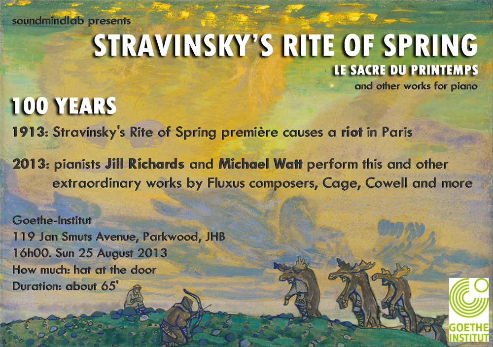
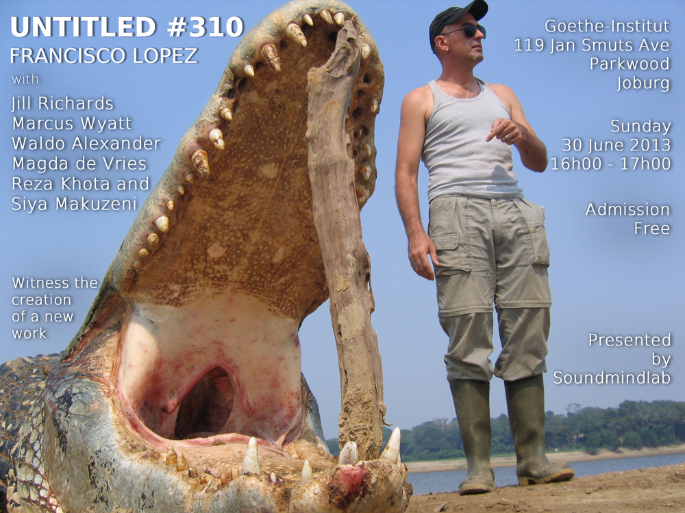
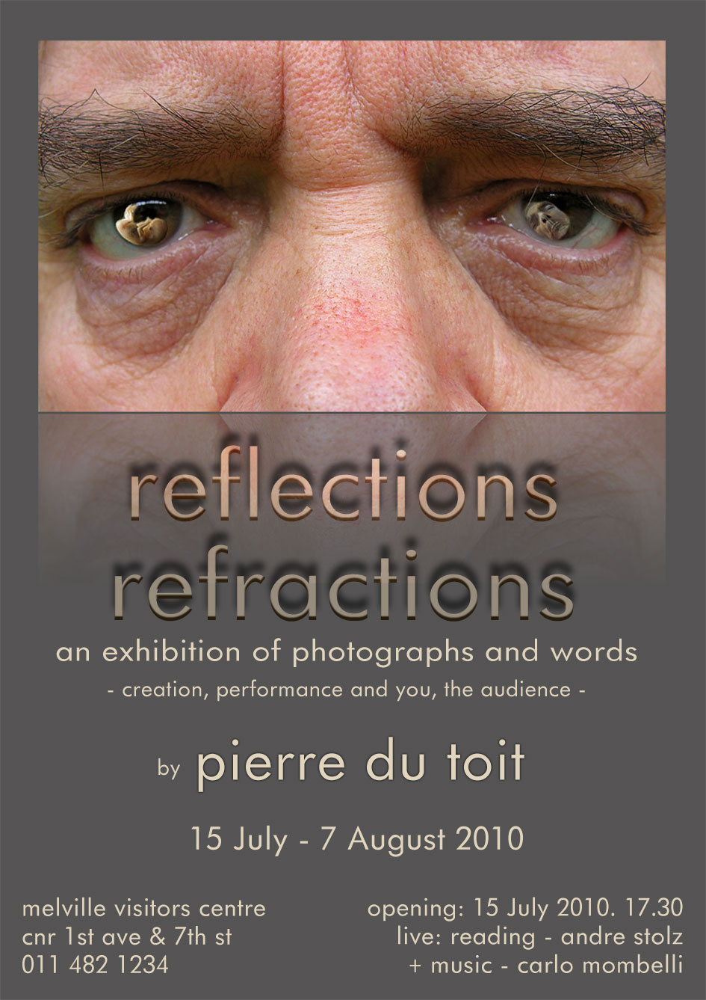
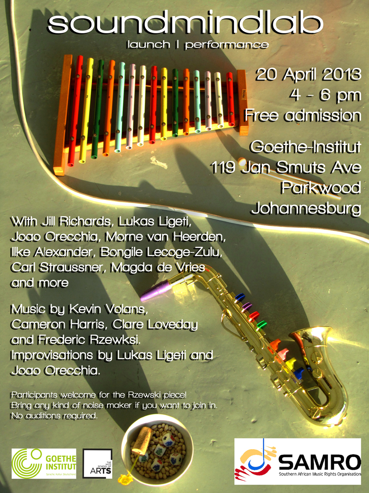

I have a concert pianist mother and a photographer father. I also love playing around with visual design. Sometimes family favours and having fun in Photoshop converge:

<figure class="left" display="block">
	<figcaption>Artwork by Nicholas Roerich</figcaption></figure>

<figure class="right"><figcaption>Photo by Francisco Lopez</figcaption></figure>

<figure class="left" style="padding-top:23px"><figcaption>Photo by Pierre du Toit</figcaption></figure>

<figure class="right"><figcaption>Artwork by William Kentridge</figcaption></figure>

<figure class="left"> <figcaption>Photo by Nicola du Toit</figcaption>
</figure>

<figure class="right"><figcaption>Photo by Tom Jarmusch</figcaption></figure>
	
<figure class="left" style="padding-top:27px"><figcaption>Photo by Pierre du Toit</figcaption></figure>

<figure class="right">
	
	<figcaption>Photo by Pierre du Toit</figcaption></figure>

<figure class="left">
</figure>
		

